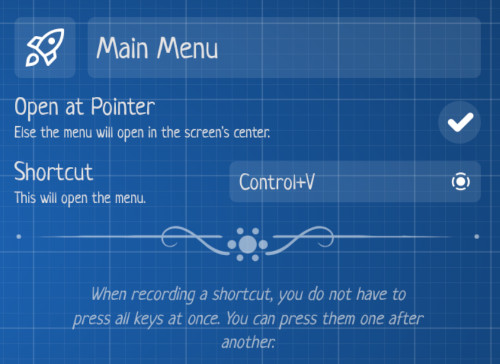

<!--
SPDX-FileCopyrightText: Simon Schneegans <code@simonschneegans.de>
SPDX-License-Identifier: CC-BY-4.0
-->

</img>

# Configuring Kando

Kando comes with an example menu which you can use to get started.
However, you should soon adapt the menu to your needs and create your own menus.

</img>

Kando comes with a **graphical menu editor** which allows you to create and edit your own menus.
There are three ways to open the menu editor:
1. **When a menu is shown:** Click the gear icon in the bottom right corner of the screen.
2. **From the system tray:** Right-click the Kando icon and select "Show Settings".
3. **From the command line:** Run `kando --settings`.

In the editor, you can create new menus, and edit existing menus.
Drag new items from the toolbar to the menu preview, reorder them, and change their properties on the right side of the screen.

## Tips for Creating Efficient Menu Layouts

When designing your own menus, keep the following tips in mind:
* **Avoid too many items in a single menu.** Instead, create submenus. Eight items per menu is a good rule of thumb, and you should never have more than twelve items in a single menu.
* **Deeply nested menus are not a problem.** Kando is designed to handle deeply nested menus. You can use the marking mode to quickly select items which are in subsubsubmenus.
* **Use the fixed-angle locks to create a clean layout.** Even if you have an odd number of items, you can use fixed angles to lock items to the top, bottom, left, or right side of the menu.

## Adding Custom Icon Themes

To add your own icons to Kando, follow these steps:
1. Create a new `icon-themes` directory in Kando's configuration directory if it does not yet exist.

## Menu Shortcuts vs. Simulated Hotkeys

With Kando, you can bind a menu to a keyboard shortcut and use menu items to simulate keyboard hotkeys or macros.
This is a bit confusing as all are configured similarly, but use different formats.

Below is the configuration of a menu bound to <kbd>Ctrl</kbd>+<kbd>V</kbd> and a menu item simulating <kbd>Ctrl</kbd>+<kbd>V</kbd>.
As you can see, the format for the key combination is different.

Menu-Shortcut Configuration | Hotkey-Item Configuration
--------------------------- | -------------------------
 | 

The reason for this is complex: Depending on the platform, Kando uses different mechanisms to bind menus to shortcuts.
All of these require _key names_ for the shortcuts.
The hotkey and macro items on the other hand simulate _key codes_.
Each key on your keyboard has a unique _key code_.
The keyboard layout you have set in your OS assigns a _key name_ to each _key code_.
For instance, the key with the _code_ `KeyZ` gets the _name_ `Y` with a German keyboard layout.

### Valid Menu Shortcuts (using _key names_)

On most platforms, Kando uses the [Electron Accelerator](https://www.electronjs.org/docs/api/accelerator) format to bind shortcuts.
Hence, each shortcut may contain any number of modifiers and must end with a key name.
All names are case-insensitive and must be separated by `+`.

**Available Modifier Names:**
<kbd>Command</kbd>
<kbd>Cmd</kbd>
<kbd>Control</kbd>
<kbd>Ctrl</kbd>
<kbd>CommandOrControl</kbd>
<kbd>CmdOrCtrl</kbd>
<kbd>Alt</kbd>
<kbd>Option</kbd>
<kbd>AltGr</kbd>
<kbd>Shift</kbd>
<kbd>Super</kbd>
<kbd>Meta</kbd>

**Available Key Names:** <kbd>0</kbd>-<kbd>9</kbd>
<kbd>A</kbd>-<kbd>Z</kbd>
<kbd>F1</kbd>-<kbd>F24</kbd>
<kbd>)</kbd>
<kbd>!</kbd>
<kbd>@</kbd>
<kbd>#</kbd>
<kbd>$</kbd>
<kbd>%</kbd>
<kbd>^</kbd>
<kbd>&</kbd>
<kbd>*</kbd>
<kbd>(</kbd>
<kbd>:</kbd>
<kbd>;</kbd>
<kbd>'</kbd>
<kbd>+</kbd>
<kbd>=</kbd>
<kbd><</kbd>
<kbd>,</kbd>
<kbd>_</kbd>
<kbd>-</kbd>
<kbd>></kbd>
<kbd>.</kbd>
<kbd>?</kbd>
<kbd>/</kbd>
<kbd>~</kbd>
<kbd>`</kbd>
<kbd>{</kbd>
<kbd>]</kbd>
<kbd>[</kbd>
<kbd>|</kbd>
<kbd>\\</kbd>
<kbd>}</kbd>
<kbd>"</kbd>
<kbd>Plus</kbd>
<kbd>Space</kbd>
<kbd>Tab</kbd>
<kbd>Capslock</kbd>
<kbd>Numlock</kbd>
<kbd>Scrolllock</kbd>
<kbd>Backspace</kbd>
<kbd>Delete</kbd>
<kbd>Insert</kbd>
<kbd>Return</kbd>
<kbd>Enter</kbd>
<kbd>Up</kbd>
<kbd>Down</kbd>
<kbd>Left</kbd>
<kbd>Right</kbd>
<kbd>Home</kbd>
<kbd>End</kbd>
<kbd>PageUp</kbd>
<kbd>PageDown</kbd>
<kbd>Escape</kbd>
<kbd>Esc</kbd>
<kbd>VolumeUp</kbd>
<kbd>VolumeDown</kbd>
<kbd>VolumeMute</kbd>
<kbd>MediaNextTrack</kbd>
<kbd>MediaPreviousTrack</kbd>
<kbd>MediaStop</kbd>
<kbd>MediaPlayPause</kbd>
<kbd>PrintScreen</kbd>
<kbd>num0</kbd>-<kbd>num9</kbd>
<kbd>numdec</kbd>
<kbd>numadd</kbd>
<kbd>numsub</kbd>
<kbd>nummult</kbd>
<kbd>numdiv</kbd>

### Valid Simulated Hotkeys (using _key codes_)

Macro items simulate keyboard hotkeys by sending key codes.
Below is a list of all available key codes.

The configuration of the hotkey items should also contain any number of modifier key codes followed by a single non-modifier key code, all separated by `+`.
Note that not all key codes are available on all platforms.

**Available Modifier Key Codes:** 
<kbd>AltLeft</kbd>
<kbd>AltRight</kbd>
<kbd>ControlLeft</kbd>
<kbd>ControlRight</kbd>
<kbd>MetaLeft</kbd>
<kbd>MetaRight</kbd>
<kbd>ShiftLeft</kbd>
<kbd>ShiftRight</kbd>

**Available Non-Modifier Key Codes:**
<kbd>Again</kbd>
<kbd>ArrowDown</kbd>
<kbd>ArrowLeft</kbd>
<kbd>ArrowRight</kbd>
<kbd>ArrowUp</kbd>
<kbd>AudioVolumeDown</kbd>
<kbd>AudioVolumeMute</kbd>
<kbd>AudioVolumeUp</kbd>
<kbd>Backquote</kbd>
<kbd>Backslash</kbd>
<kbd>Backspace</kbd>
<kbd>BracketLeft</kbd>
<kbd>BracketRight</kbd>
<kbd>BrowserBack</kbd>
<kbd>BrowserFavorites</kbd>
<kbd>BrowserForward</kbd>
<kbd>BrowserHome</kbd>
<kbd>BrowserRefresh</kbd>
<kbd>BrowserSearch</kbd>
<kbd>BrowserStop</kbd>
<kbd>CapsLock</kbd>
<kbd>Comma</kbd>
<kbd>ContextMenu</kbd>
<kbd>Convert</kbd>
<kbd>Copy</kbd>
<kbd>Cut</kbd>
<kbd>Delete</kbd>
<kbd>Digit0</kbd>-<kbd>Digit9</kbd>
<kbd>Eject</kbd>
<kbd>End</kbd>
<kbd>Enter</kbd>
<kbd>Equal</kbd>
<kbd>Escape</kbd>
<kbd>F1</kbd>-<kbd>F24</kbd>
<kbd>Find</kbd>
<kbd>Help</kbd>
<kbd>Home</kbd>
<kbd>Insert</kbd>
<kbd>IntlBackslash</kbd>
<kbd>IntlRo</kbd>
<kbd>IntlYen</kbd>
<kbd>KanaMode</kbd>
<kbd>KeyA</kbd>-<kbd>KeyZ</kbd>
<kbd>Lang1</kbd>-<kbd>Lang5</kbd>
<kbd>LaunchApp1</kbd>
<kbd>LaunchApp2</kbd>
<kbd>LaunchMail</kbd>
<kbd>MediaPlayPause</kbd>
<kbd>MediaSelect</kbd>
<kbd>MediaStop</kbd>
<kbd>MediaTrackNext</kbd>
<kbd>MediaTrackPrevious</kbd>
<kbd>Minus</kbd>
<kbd>NonConvert</kbd>
<kbd>NumLock</kbd>
<kbd>Numpad0</kbd>-<kbd>Numpad9</kbd>
<kbd>NumpadAdd</kbd>
<kbd>NumpadComma</kbd>
<kbd>NumpadDecimal</kbd>
<kbd>NumpadDivide</kbd>
<kbd>NumpadEnter</kbd>
<kbd>NumpadEqual</kbd>
<kbd>NumpadMultiply</kbd>
<kbd>NumpadParenLeft</kbd>
<kbd>NumpadParenRight</kbd>
<kbd>NumpadSubtract</kbd>
<kbd>Open</kbd>
<kbd>PageDown</kbd>
<kbd>PageUp</kbd>
<kbd>Paste</kbd>
<kbd>Pause</kbd>
<kbd>Period</kbd>
<kbd>Power</kbd>
<kbd>PrintScreen</kbd>
<kbd>Quote</kbd>
<kbd>ScrollLock</kbd>
<kbd>Select</kbd>
<kbd>Semicolon</kbd>
<kbd>Slash</kbd>
<kbd>Sleep</kbd>
<kbd>Space</kbd>
<kbd>Tab</kbd>
<kbd>Undo</kbd>
<kbd>WakeUp</kbd>

  
  <a href="usage.md"> Using Kando</a>
  
  <a href="README.md"> Index</a>
  
  <a href="config-files.md">The Configuration Files </a>
  

